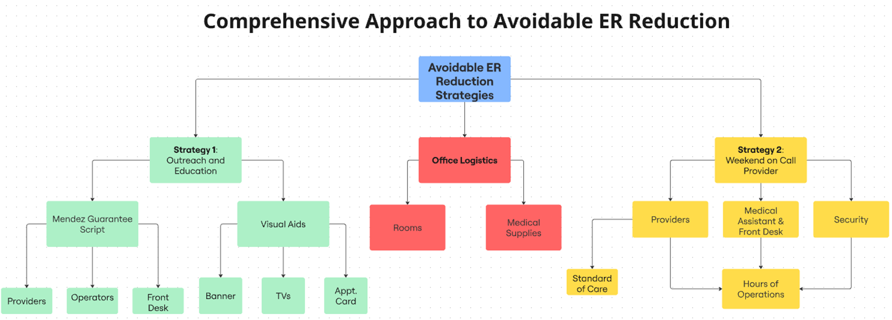

# Avoidable ED Visits – Primary Care Intervention

> A real-world healthcare data science project reducing unnecessary ED costs through evidence-based primary care.

---

## 📑 Table of Contents
- [📌 Project Summary](#-project-summary)
- [🧠 Intervention Strategy Diagram](#-intervention-strategy-diagram)
- [📄 Article](#-article)
- [📓 Jupyter Notebook](#-jupyter-notebook)
- [📈 Key Findings](#-key-findings)
- [🛠️ Tools & Techniques](#-tools--techniques)
- [🌍 Real-World Impact](#-real-world-impact)
- [🔗 Connect](#-connect)

---

## 📌 Project Summary

This project presents a data-driven strategy to reduce **avoidable Emergency Department (ED) visits** among **Medicare Advantage** patients at **Mendez Medical Center**, using:

- **The NYU Emergency Department Algorithm (NYU-EDA)**
- **Physician-reviewed ICD-10 diagnoses**
- **Time-of-day and hospital-level analysis**
- **Financial impact modeling**

---

## 🗺️ Intervention Strategy Diagram

A high-level view of the comprehensive approach implemented at **Mendez Medical Center** to reduce avoidable ER visits:

---

## 📄 Article

📎 **[Download PDF](./Bandeira_Using_NYU_ED_Algorithm_to_Reduce_Avoidable_Visits_June2025.pdf)** – Full academic-style report

---

## 💻📂 Jupyter Notebook

Explore the full analysis and code in the Jupyter Notebook:  
🔍 **[View Notebooks](notebooks/)**

---

## 📊 Key Findings

- **40.2% avoidable ED** rate among 15,253 claims
- Peak visits during after-hours and weekends
- Facility-level variation (Chi-Square tested)
- Estimated savings: **$2M–$2.7M/year**
- Intervention strategies: *Mendez Guarantee*, discharge education, protocol standardization

---

## 🛠 Tools & Techniques

- **Python** (data wrangling, statistical modeling, classification logic)
- **Pandas**, **NumPy** (data manipulation and computation)
- **Matplotlib** & **Seaborn** (data visualization)
- **Statsmodels** (statistical inference, proportion testing)
- **NYU-EDA Classification** (Emergency Department algorithm)
- **ICD-10 Physician Review** (manual validation of diagnostic codes)
- **Time-based and Facility-level ED visit analysis**
- **Cost savings estimation using HCUP & CMS data**

---

## 🌍💡 Real-World Impact

This project aligns with value-based care and aims to:

- Reduce unnecessary healthcare spending  
- Improve patient access and continuity  
- Support primary care team operations and workflow design

---

## 📫 Connect

[Connect with me on LinkedIn](https://www.linkedin.com/in/thiago-bandeira-ai/)

